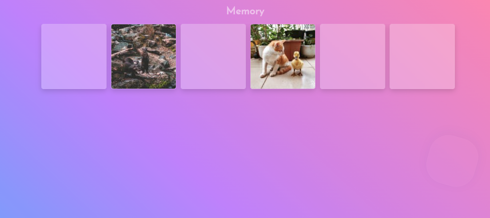
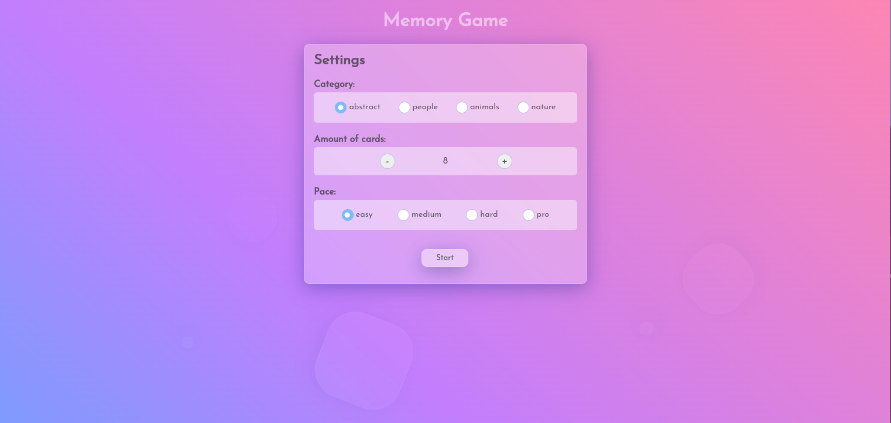
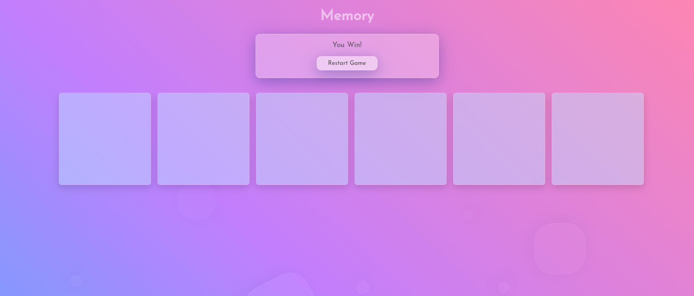

# Memory - Game

## Description

<p>Test your image recognition with the <b>Memory Game!</b></p>
<p>This game was made to practice React and API calls.</p>

## Preview

<p>Game Board</p>

<p>Main-Settings</p>

<p>Reset</p>


### Tech stack

```
Core:
- React.js
- React.js hooks
- PropTypes
- CSS

Communication tool:
- fetch
```

## Available Scripts

In the project directory, you can run:

### `npm start`

Runs the app in the development mode.\
Open [http://localhost:3000](http://localhost:3000) to view it in your browser.

The page will reload when you make changes.\
You may also see any lint errors in the console.

### `npm test`

Launches the test runner in the interactive watch mode.